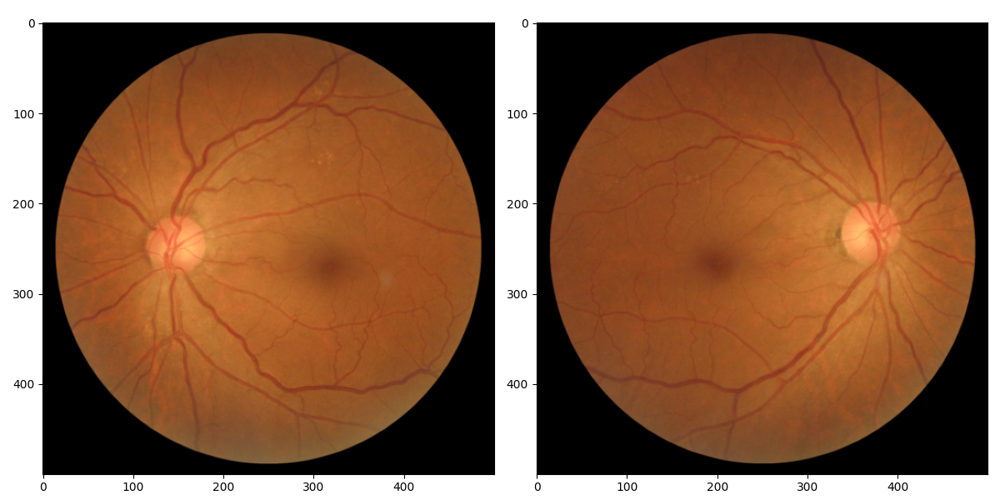

# Ocular Disease Recognition using SwAV model

## Introduction

Early diagnosis and treatment of ophthalmic diseases such as glaucoma, catarct and AMD are important because they significantly reduce quality of life.
Eye fundus images are useful in identifying such ophthalmologic diseases.
Here I will introduce ocular disease recognition model that uses eye fundus images as input and trains multi-labels of ocular diseases in a supervised learning.
The results of inference were evaluated by area under the curve (AUC) of reciever operating characteristics (ROC).

## Dataset

The `ODIR-5K` dataset includes both eye fundus images of 3500 patients for training.
These eye fundus images are annotated with 8 labels indicating normal, 6 major ocular diseases and other ocuar diseases.



### Count of Eye Fundus Images for each Disease Labels

```
               train   test  train+test      %
Normal        2541.0  275.0      2816.0   40.0
Diabetes      1598.0  180.0      1778.0   25.3
Glaucoma       274.0   39.0       313.0    4.4
Cataract       251.0   24.0       275.0    3.9
AMD            250.0   30.0       280.0    4.0
Hypertension   174.0   18.0       192.0    2.7
Myopia         240.0   22.0       262.0    3.7
Others         995.0  129.0      1124.0   16.0
Total         6323.0  717.0      7040.0  100.0
```

## Model

`SwAV`, Swappnig Assignments between Views with ResNet-50.


## Results

```bash
python main.py

epoch   1/150 batch 185/185 loss 1.9718 1368.4sec mean AUC 0.581 (0.537 0.555 0.534 0.840 0.530 0.462 0.670 0.520)
epoch   2/150 batch 185/185 loss 1.8609 1360.0sec mean AUC 0.662 (0.580 0.609 0.631 0.947 0.589 0.419 0.944 0.575)
epoch   3/150 batch 185/185 loss 1.8345 1355.4sec mean AUC 0.660 (0.552 0.629 0.634 0.951 0.541 0.406 0.960 0.607)
epoch   4/150 batch 185/185 loss 1.8252 1344.9sec mean AUC 0.648 (0.535 0.626 0.644 0.932 0.451 0.389 0.969 0.636)
epoch   5/150 batch 185/185 loss 1.8168 1343.1sec mean AUC 0.669 (0.521 0.634 0.677 0.958 0.480 0.457 0.970 0.655)
...
epoch 146/150 batch 185/185 loss 1.6063 1377.4sec mean AUC 0.887 (0.876 0.899 0.942 0.985 0.933 0.546 0.996 0.918)
epoch 147/150 batch 185/185 loss 1.6042 1358.2sec mean AUC 0.884 (0.881 0.902 0.952 0.988 0.938 0.503 0.995 0.909)
epoch 148/150 batch 185/185 loss 1.6031 1372.9sec mean AUC 0.883 (0.882 0.895 0.948 0.981 0.942 0.506 0.997 0.914)
epoch 149/150 batch 185/185 loss 1.6107 1361.8sec mean AUC 0.879 (0.876 0.890 0.943 0.986 0.931 0.499 0.994 0.910)
epoch 150/150 batch 185/185 loss 1.6011 1373.0sec mean AUC 0.885 (0.874 0.901 0.937 0.975 0.948 0.537 0.994 0.916)

test batch  21/ 21 loss 1.7460 141.5sec mean AUC 0.818 (0.773 0.763 0.858 0.950 0.917 0.565 0.980 0.736)
```

## Refrences

- [ODIR-5K](https://www.kaggle.com/datasets/andrewmvd/ocular-disease-recognition-odir5k)
- [ODIR-2019](https://github.com/JordiCorbilla/ocular-disease-intelligent-recognition-deep-learning)
- [SwAV](https://github.com/facebookresearch/swav)
